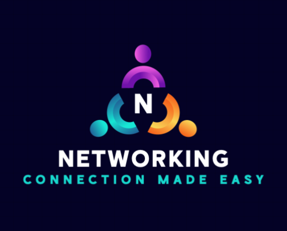
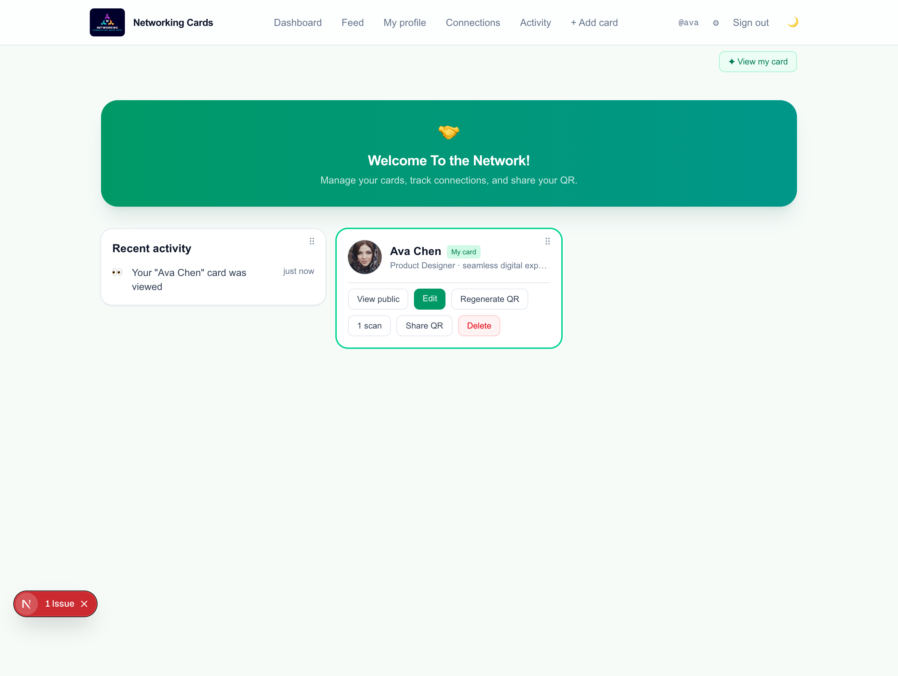
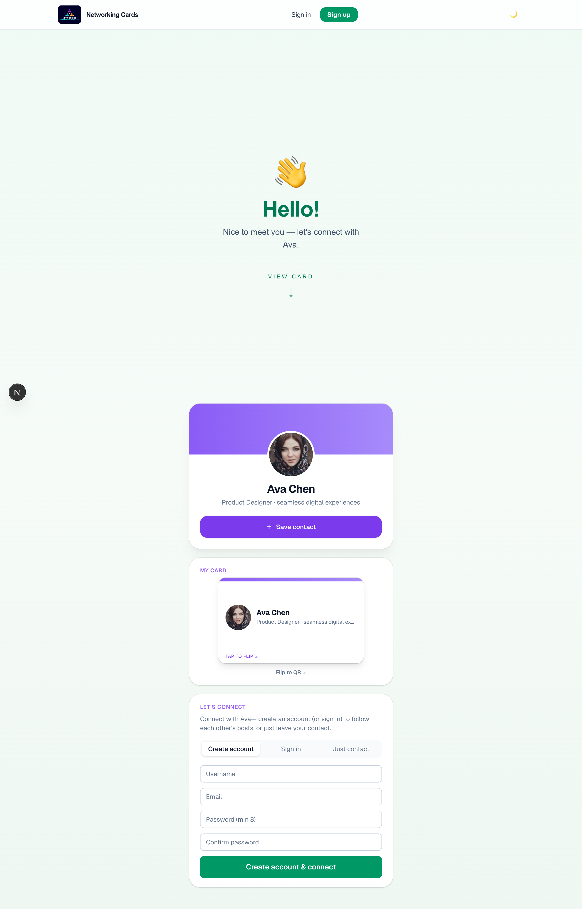
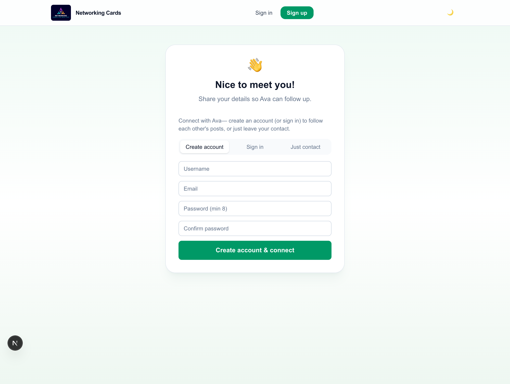
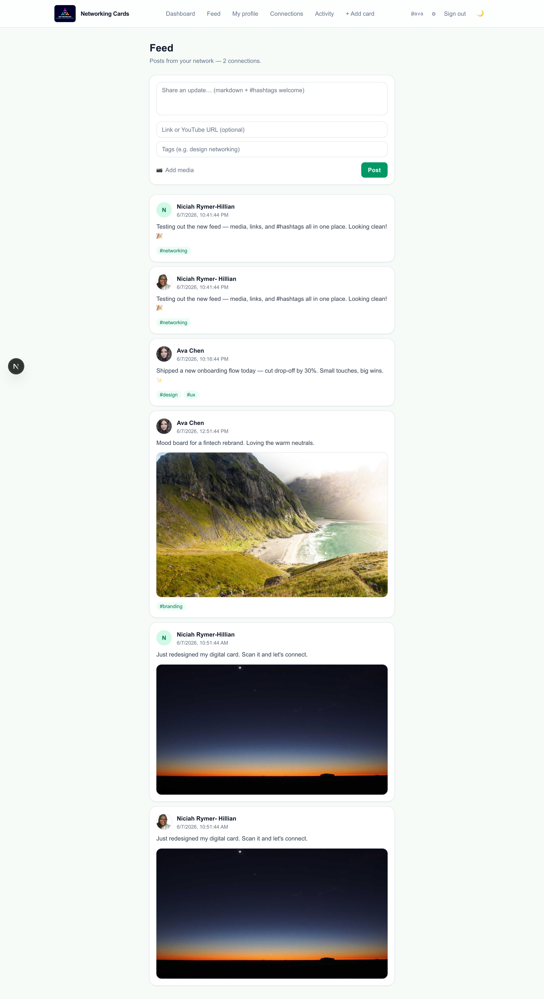

# 🤝 Networking Cards

### Your digital business card — shared by QR, kept alive after the handshake

&nbsp;

[**🌐 Live demo**](https://networking-cards.vercel.app) · [**📖 Walkthrough**](docs/walkthrough.md) · [**📲 Install guide**](https://networking-cards.vercel.app/faqs)

Networking-App is a full-stack professional networking platform designed to modernize how people build and maintain professional relationships. Instead of relying on traditional paper business cards, users create dynamic digital profiles that can be shared instantly through QR codes — making networking more accessible, interactive, and long-lasting.

The platform combines digital business cards, a social feed, direct + group messaging, a connections graph, and engagement analytics into a single experience for students, professionals, entrepreneurs, and community builders.

## 📖 Demo walkthrough

Create a card, share its QR, and once someone connects you both see each other's posts,
can message, and stay in touch long after the event. **[See the full picture-by-picture walkthrough →](docs/walkthrough.md)**

| Your digital card | Connect by QR | The connections feed |
|---|---|---|
|  |  |  |

> **📲 Installable:** add it to your phone or desktop home screen from the [install guide](https://networking-cards.vercel.app/faqs) — it runs full-screen like a native app, with unread badges on the icon.

---

## Why Networking-App Was Built

Traditional networking often ends after the initial exchange of contact information. Paper business cards are easily lost, contact details become outdated, and valuable professional connections can fade over time.

Networking-App was built to:

* Modernize professional networking
* Replace traditional paper business cards
* Simplify professional information sharing
* Create lasting professional connections
* Provide a platform for showcasing projects and achievements
* Encourage ongoing engagement after networking events

---

## Key Features

### Digital Cards & QR Networking

* Design customizable cards (templates, palettes, fonts) with a live preview
* Generate a unique QR code + shareable link per card
* Support multiple cards per account (e.g. one per role/career)
* Capture contacts instantly at events — no paper, no lost details

### Social Feed & Engagement

* Post updates with photos, links, and clickable `#hashtags`
* Emoji reactions (line-smiley picker), threaded comments, and post permalinks
* Hashtag search across your network's posts

### Messaging

* Direct messages and group conversation rooms
* Share feed posts into chats; emoji message reactions
* Connection-gated — you message people you're actually connected with

### Connections & Discovery

* Mutual connection graph powering a "People you may know" suggester
* Privacy-safe account previews (mutuals, topics, bio) before you connect
* Confirm-to-connect requests captured from your card's QR

### Notifications & Analytics

* Unread bubbles on Feed / Connections / Messages + an installed-app icon badge
* Activity feed: "card viewed by @user", "new connection request from …"
* Track scans vs. connections to see conversion at a glance

### Privacy & Security

* Account emails encrypted at rest (AES-256-GCM); passwords hashed (bcrypt)
* Connection PII encrypted; private card photos served only to the owner
* Connections-only profiles — contact details unlock after you connect

---

## Tech Stack

| Layer          | Technologies                                              |
| -------------- | -------------------------------------------------------- |
| Frontend       | Next.js 16 (App Router), React 19, TypeScript, Tailwind CSS v4 |
| Backend        | Next.js Route Handlers, Prisma 7 ORM                     |
| Database       | Turso (libSQL) in prod · SQLite for local dev            |
| Auth & Security| iron-session (encrypted cookies), bcrypt, AES-256-GCM     |
| Storage        | Supabase Storage (headshots, business-card PDFs)         |
| QR             | `qrcode`                                                 |
| PWA            | Web manifest, service worker, Web Badging API            |
| Deployment     | Vercel · GitHub Actions (storage keep-alive cron)        |

---

## Platform Workflows

### Professionals

* Create and customize a digital card
* Generate a personal QR code and share it instantly
* Post updates and showcase work in the feed
* Build and manage professional connections, and message them

### Event Attendees

* Scan a QR code to view a card
* Send a connection request (or connect instantly if signed in)
* Save the connection and stay in touch through the feed + messages

### Community Builders

* Facilitate networking before, during, and after events
* Support professional communities with a shared feed and rooms
* Improve event networking with lasting digital connections

---

## Impact

Networking-App aims to improve professional networking by making connections easier to create, maintain, and grow over time.

The platform demonstrates how modern web technologies, a digital-identity model, and an installable PWA experience can transform traditional networking into an ongoing professional relationship-building experience.

---

## Screenshots

The screenshots in [`docs/screenshots/`](docs/screenshots) demonstrate:

* Digital card design and QR sharing
* The connection capture flow
* The dashboard, analytics, and activity
* The social feed and engagement
* Profile and portfolio views
* Responsive, installable (PWA) UI

---

## Future Roadmap

* Push notifications for live, background badge updates
* Enhanced card customization and portfolio blocks
* Smarter networking suggestions
* Event management integrations
* Team and organization profiles
* Advanced networking analytics

---

## Repository Structure

* `app/` — Application routes, pages, and API route handlers
* `components/` — Reusable UI components
* `lib/` — Utilities and application services (auth, crypto, db)
* `prisma/` — Schema and database
* `scripts/` — Seed and maintenance scripts
* `references/` — Engineering playbooks and design notes
* `public/` — Static assets (logo, PWA icons)
* `README.md` — Project documentation
